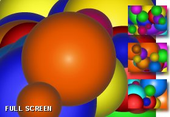



## Gradient Globes

### Description

Yet another...   ...gradient globes, full screen demo. It runs really fast, but this one won't demand as many CPU cycles on the slower speeds. Small enough to hide in other programs! ;-)
 
### More Info
 

             |
---                |---
**Submitted On**   |2005-05-15 06:12:02
**By**             |[Larry Serflaten](https://github.com/Planet-Source-Code/PSCIndex/blob/master/ByAuthor/larry-serflaten.md)
**Level**          |Beginner
**User Rating**    |4.2 (25 globes from 6 users)
**Compatibility**  |VB 5\.0, VB 6\.0
**Category**       |[Miscellaneous](https://github.com/Planet-Source-Code/PSCIndex/blob/master/ByCategory/miscellaneous__1-1.md)
**World**          |[Visual Basic](https://github.com/Planet-Source-Code/PSCIndex/blob/master/ByWorld/visual-basic.md)
**Archive File**   |[Gradient\_G1888445152005\.ZIP](https://github.com/Planet-Source-Code/larry-serflaten-gradient-globes__1-60539/archive/master.zip)

